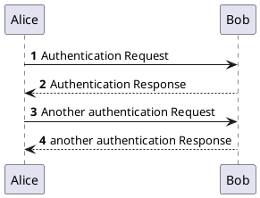
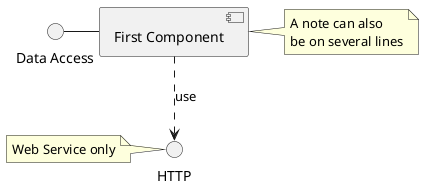
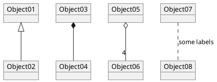

```code
@startuml
autonumber

Alice -> Bob: Authentication Request
Bob --> Alice: Authentication Response

Alice -> Bob: Another authentication Request
Alice <-- Bob: another authentication Response
@enduml
```

- [documentation](http://plantuml.com/)


# some more examples

```plantuml
@startsalt
{
  Login    | "MyName   "
  Password | "****     "
  [Cancel] | [  OK   ]
}
@endsalt
```








