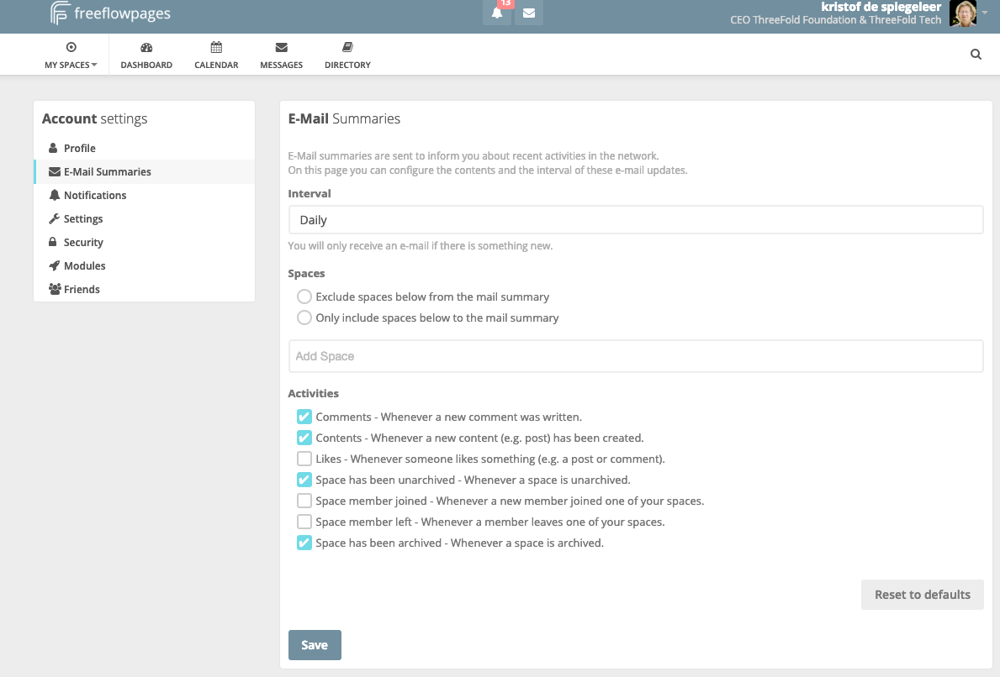
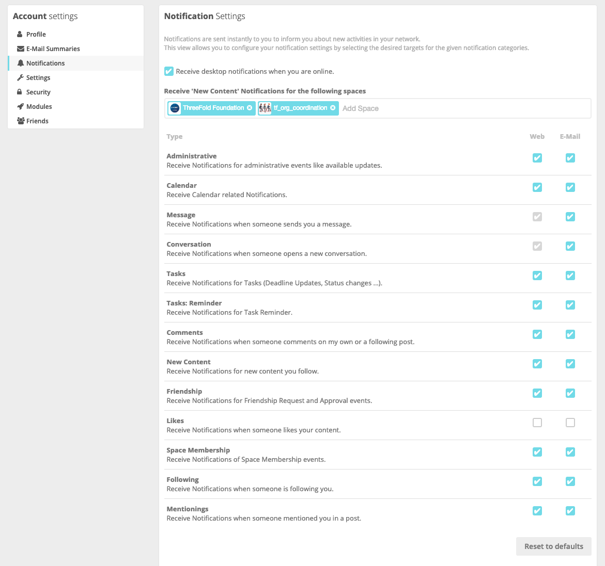
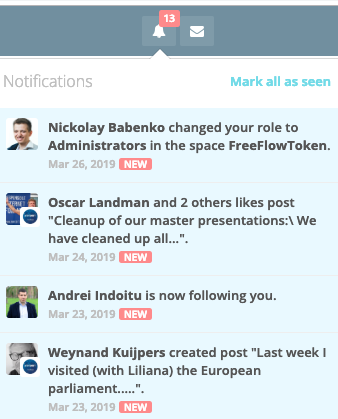
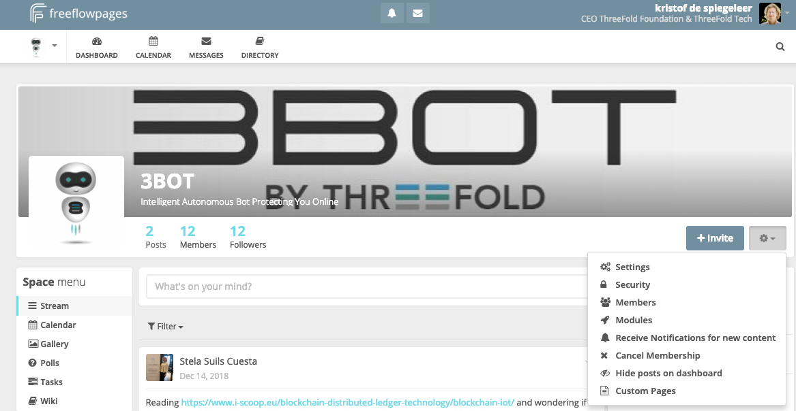

## settings freeflow pages

the email summaries are super important, best to put on daily and check what you want to be informed about.

These are the notifications which popup onto your freeflow pages screen.

notifications example, make sure you configure your browser to show them.

## how to change how content makes popups

See the "Receive Notifications for new content" if you choose this then it will popup in your notification screen.

