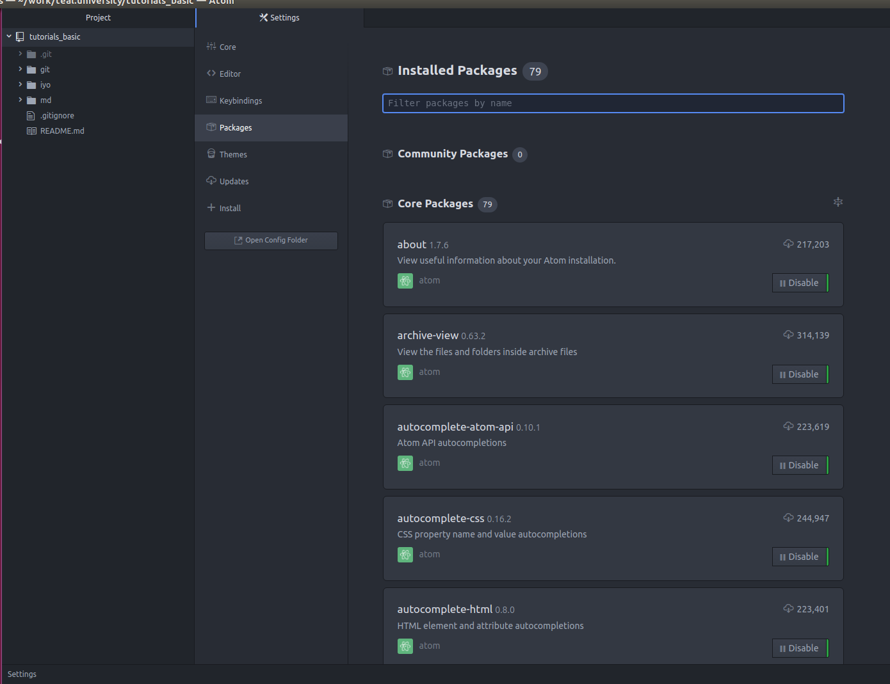

# Using GIT inside Atom

There is a convenient way to work with git from [Atom](https://atom.io/) editor.

## Installation
Open Atom and go to Top Menu -> 'Edit' -> 'Preferences', and in preferences choose 'Packages' section:
