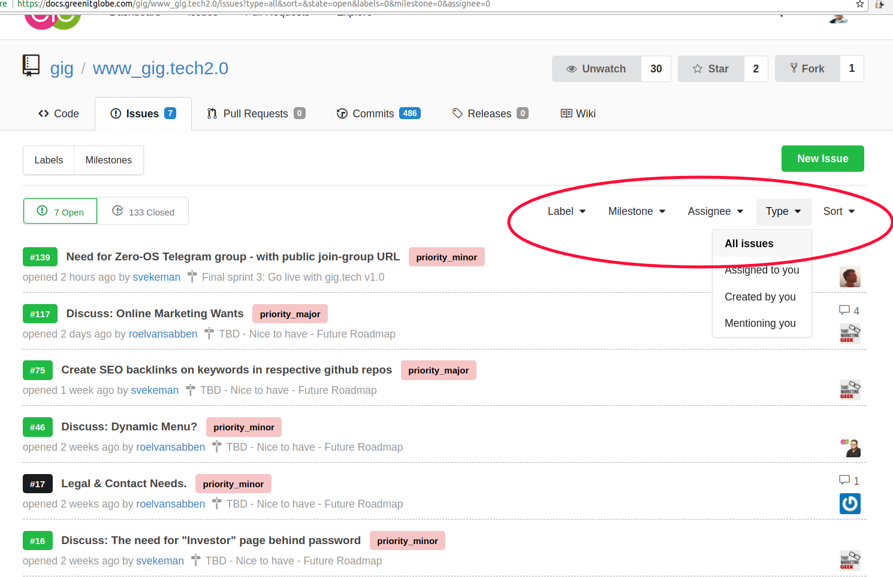
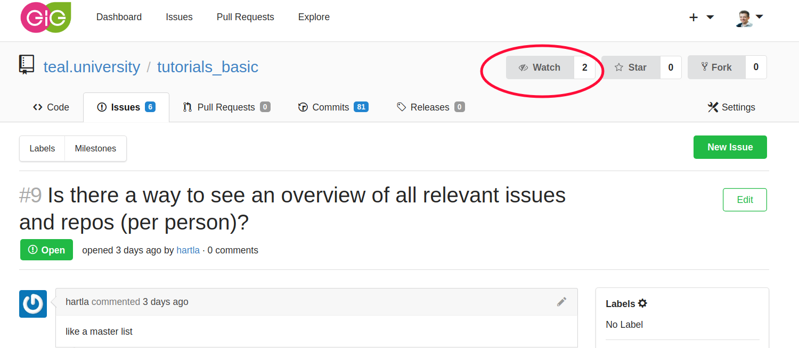
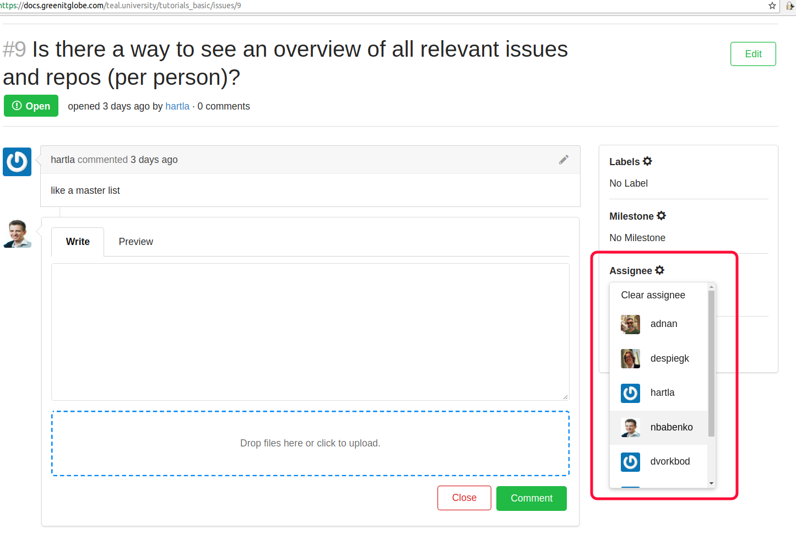
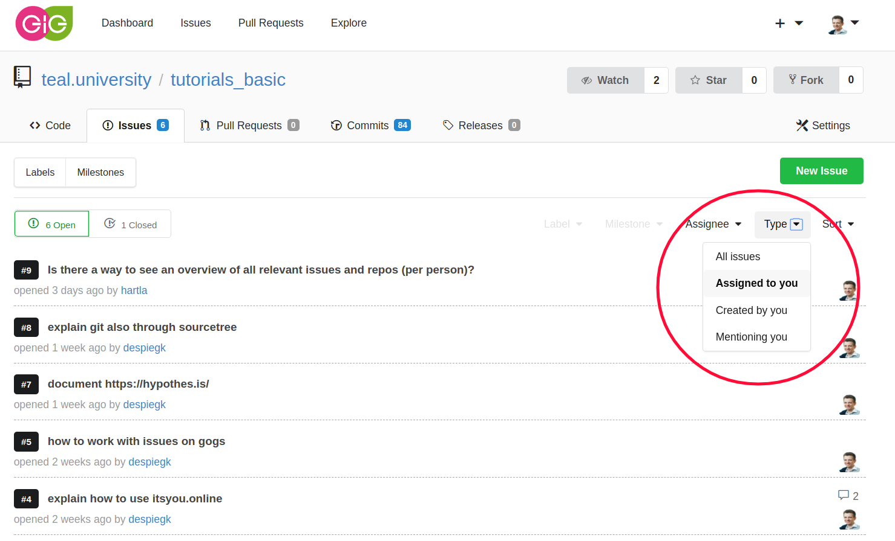
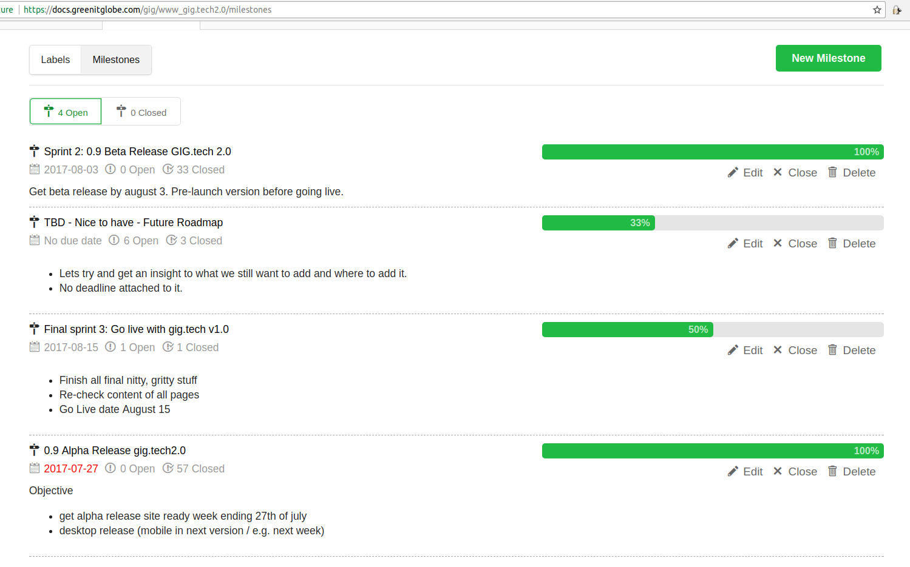

# Task-management with GOGs 
We use GOGs (self-hosted git) for keeping source codes, documentation and as a project management tool.

As the first step, please check definitions:
* [Project](https://docs.greenitglobe.com/teal.university/whatis/src/master/teal_definitions.md#project)
* [Milestone](https://docs.greenitglobe.com/teal.university/whatis/src/master/teal_definitions.md#milestone)

Each project (represented by a repository in GOGs) have list of issues.
1. Any team member can create issues. Tasks to be done, bugs, problems, discussions. 
2. Issues can be grouped in Milestones.
3. Issues can be assigned to someone.
4. Issues can have labels to simplify filetering and distingusing. 

## Issues
Anyone is welcome can create issues.

When you open repository, in top menu there is an 'Issues' section.

You can filter issues by Labels, Milestones, Assignments and other properties.

## Notifications
You will get email notifications on all changes in the project if you select to "Watch" project:

## Assignments
An issues can be assigned to anyone or can be left without assignement.

You can also filter issues to see assigned to assigned to anybody or to see assigned to you:

## Milestones
[Milestones](https://docs.greenitglobe.com/teal.university/whatis/src/master/teal_definitions.md#milestone) a set of tasks to be delivered by specific date as agreen withing the team. 

