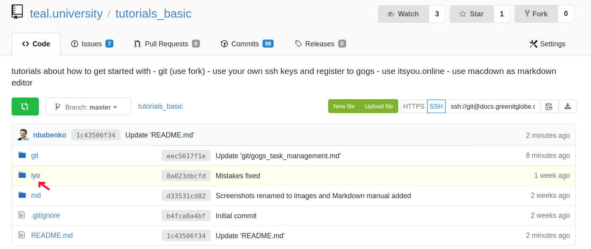
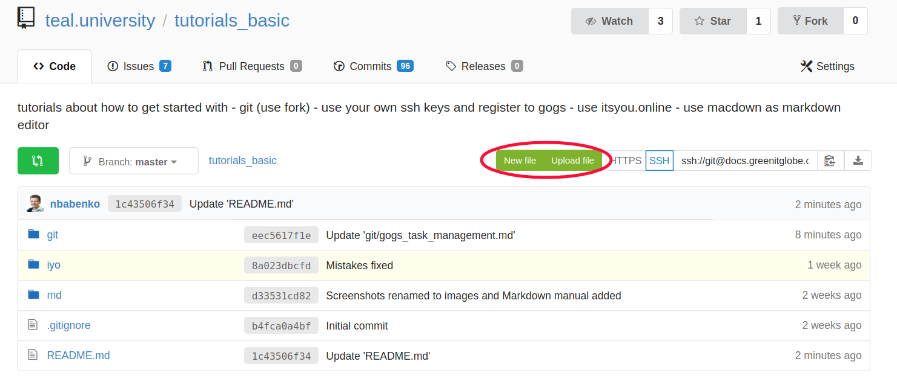
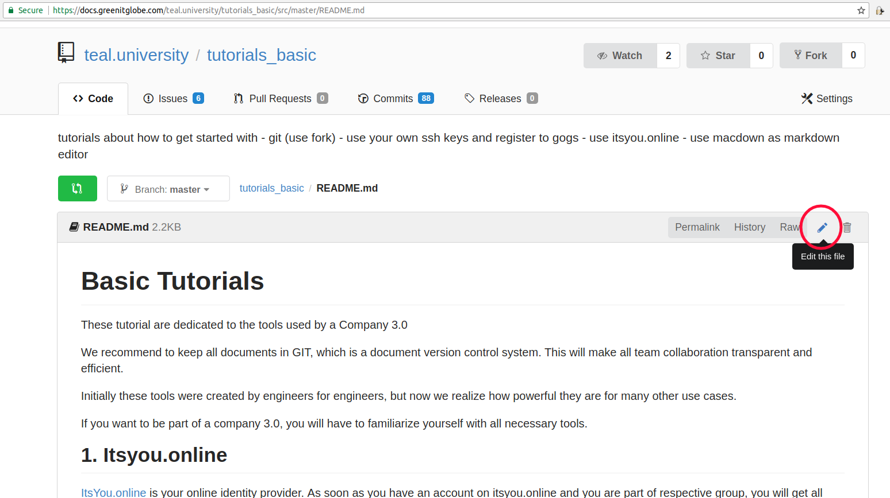
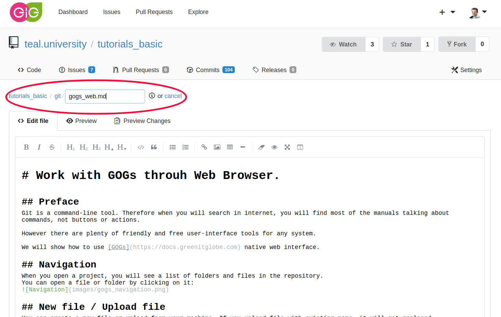

# Work with GOGs throuh Web Browser.

## Preface
Git is a command-line tool. Therefore when you will search in internet, you will find most of the manuals talking about commands, not buttons or actions.

However there are plenty of friendly and free user-interface tools for any system.

We will show how to use [GOGs](https://docs.greenitglobe.com) native web interface.

## Navigation
When you open a project, you will see a list of folders and files in the repository.
You can open a file or folder by clicking on it:

## New file / Upload file
You can create a new file or upload from your machine. If you upload file with existing name, it will get replaced.

## Edit file
When you open file and it is in a text format, you can edit it:

When edit is finished, you can save it by clicking "Commit Changes" buttom in the bottom.

## Rename / Move files / Create a folder
GIT does not track folders separately. There is no empty folders. As soon as you want to put file to some folder, it will create respective folder. 
You can move files or rename them in the same window. If you remove the name of the file, you will be able to edit folder path.

