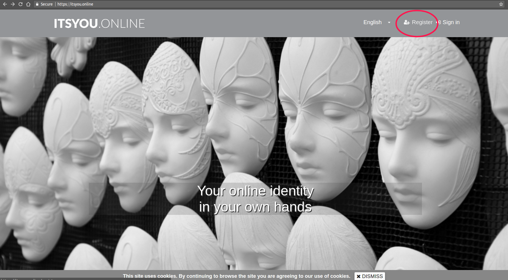
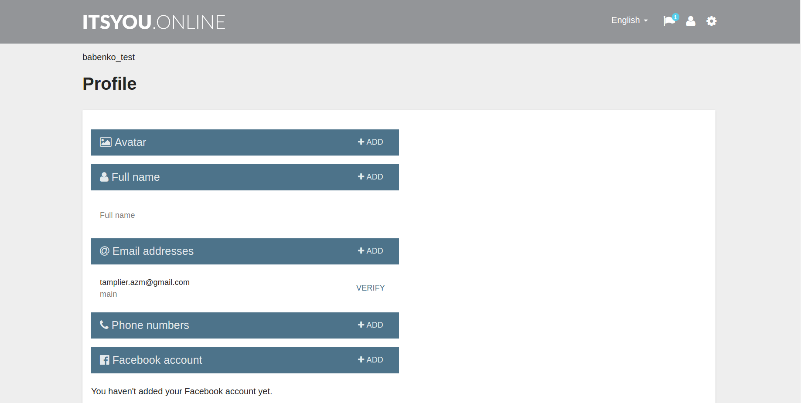
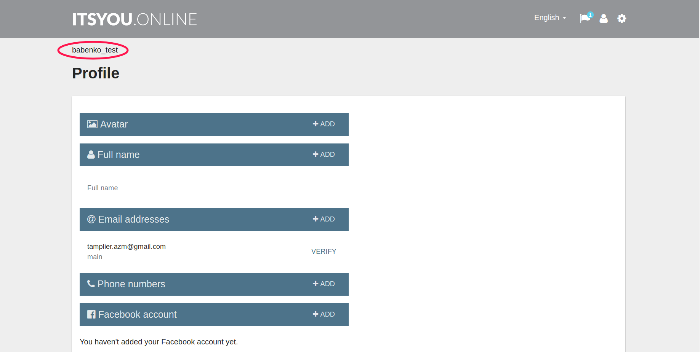
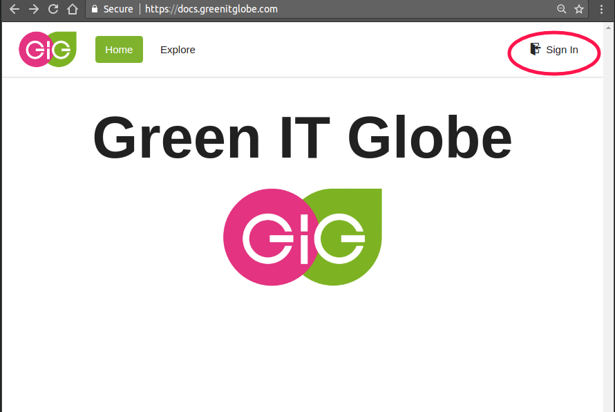
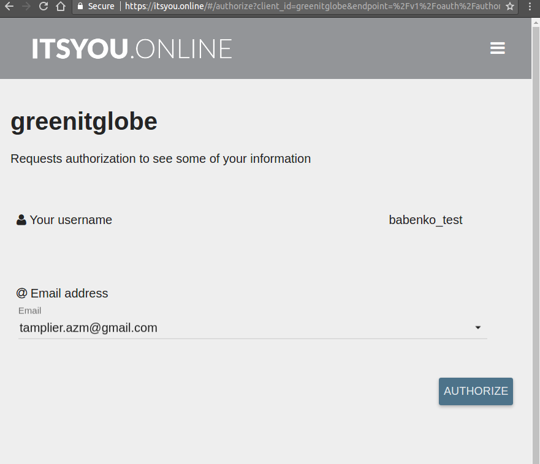
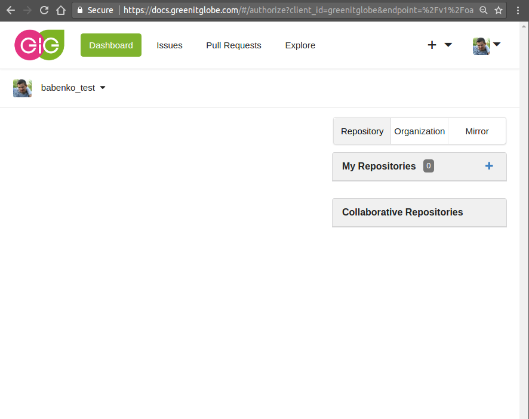

# Itsyou.online

## Intro

[Itsyou.online](itsyou.online) is an identity provider that our group of companies will be integrating in all our products. Identity provider means you sign in (enter login and password) one time here and then you are getting access to all your resources which uses IYO. Like Google Login or Facebook login.

## Signing up
1. Go to [itsyou.online](https://itsyou.online/) and click `Register`:

2. On the next screen fill in Basic Info (username, email, password) and second factor for authentication (most simple - phone number).
3. Verify your email.
4. After registration, you will see `Profile` page. Fill in as much information as possible. It will make your life easier in future.
.
5. People now can give you access to the resources managed with IYO. Your login (username) that you should share with others and how others can find you is located.

## Usage
Whatever resources are integrated with IYO can be accessed with IYO credentials.
For example
1. [Docs.greenitglobe.com](https://docs.greenitglobe.com/):

2. 
3. 
