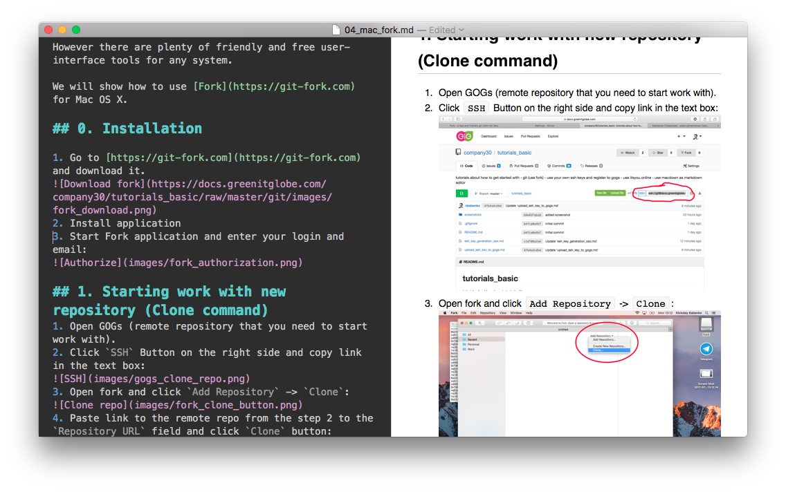
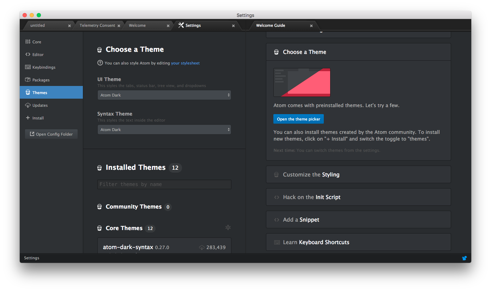
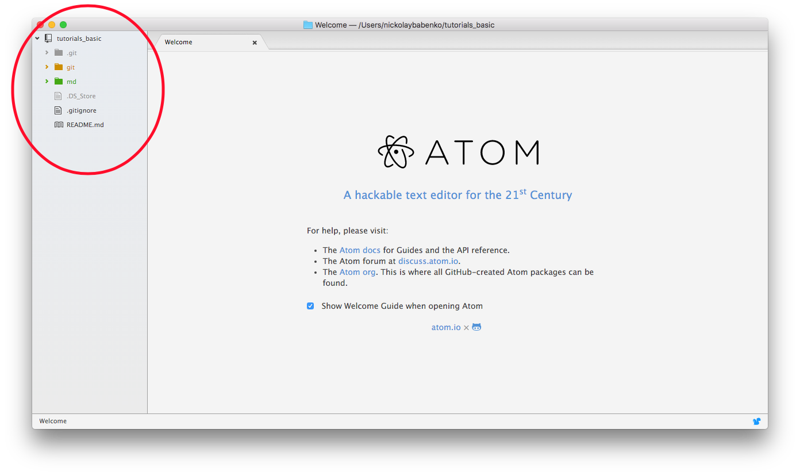
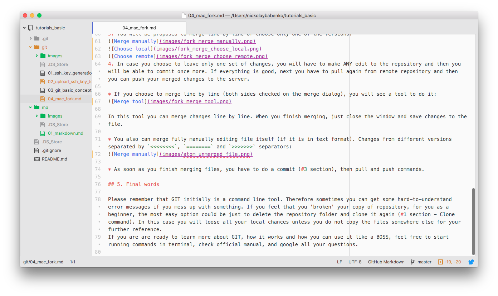
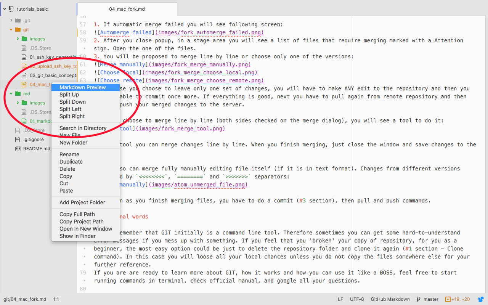
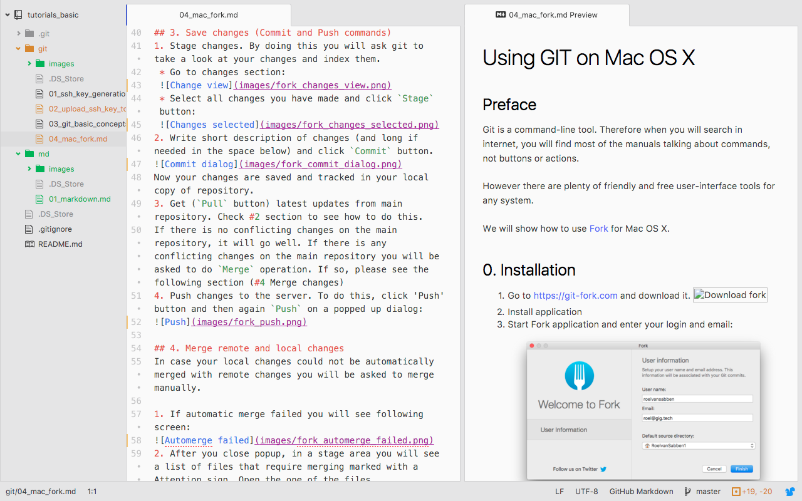

# Markdown manual

## Introduction
[Markdown](https://en.wikipedia.org/wiki/Markdown) is a simple and easy instrument to work with texts. It is a simple set of rules how you format your text for nice rendering in browser.
It is used when you navigate in GOGs (our GIT), when we deploy texts to website or when you open the file with specific tools locally.
On your computer it will look like files with .md extension with plain text inside flavored by special markup.

You can use [Markdown Cheatsheet](https://github.com/adam-p/markdown-here/wiki/Markdown-Cheatsheet#code) (google: markdown cheatsheet) as a quick hint on how to do things in markdown.

# Using MacDown
[MacDown](https://macdown.uranusjr.com) is a simple md file editor for Mac OS X. Just download it, and open .md files with it.

Left side is for edits and on the right side you will see how it will look like on a website.

# Using Atom
[Atom](https://atom.io) is another way to work with .md files. It is a powerful environment to work with text-based documents. With atom you can see all your repository structure on a separate view, which is quite convenient. 

1. Initially it will be in a dark theme. Not everybody likes it, so you can change it going to `Atom` menu secion -> `Preferences` -> `Themes` or by clicking on `Choose a Theme` on a welcome screen. You will have to change both `UI Theme` and `Syntax Theme` to light ones. 

2. Next step is opening a project. Go to `File` -> `Add Project Folder...` or click `Open Project` directly from Welcome guide. Select a folder where your project (repository) is located. If you did right, you will see it on the left view:

3. Navigate on the project view to a specific file which you want to edit and open it:

4. If you want to see how markdown will look like on a website, open context menu of the file and click `Markdown Preview`:

You will see it in a splitted window:

